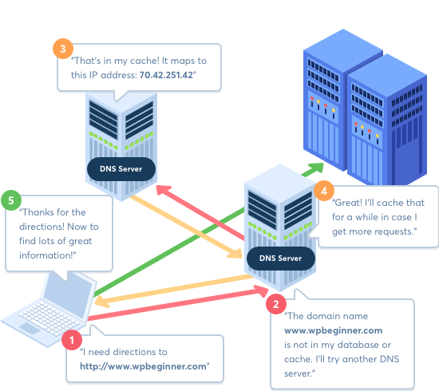

# SPRINT 5. TYPESCRIPT & API.

###### Sumari

- Introducció i Objectius

- Part teòrica.
  
  - Curs TypeScript.
  
  - Curs API REST

- Part Pràctica. S5. Acudits.

---

## INTRODUCCIÓ I OBJECTIUS

Si has entès bé ES6, no et costarà molt aprendre aquest sprint. Hauràs de conèixer la sintaxi del "tipat" de variables, interfícies, classes i genèrics.

**TypeScript** compila codi JavaScript amb l'objectiu de poder aplicar l'executat en qualsevol navegador, tractant de millorar l'experiència i la productivitat dels desenvolupadors/es.

La segona part de l'sprint s'enfoca a conceptes bàsics d'**API**. Al principi, pot resultar complicat entendre-ho, però la part positiva és que una vegada t'adaptis a les seves funcionalitats i característiques consumint dades d'una **API**, també et servirà per poder utilitzar-ne d'altres, ja que, tenen característiques i funcionalitats molt similars entre elles.

###### Durada de l'sprint

15 dies lectius.

##### **Objectius generals**

- Entendre l'avantatge de **TypeScript** i aprendre la seva sintaxi.

- Aprendre a consumir dades d'una **API Rest**.

##### **Objectius específics**

- Programar la teva primera aplicació web amb TypeScript, fent servir el tipat fort.

- Entendre l'ecosistema web: front end, back end, base de dades, API.

- Saber llegir documentació d'una API.

- Fer proves d'una API amb Postman.

---

## PART TEÒRICA. TYPESCRIPT & API REST

### CURS DE TYPESCRIPT

#### JavaScript orientat a objectes

Abans de començar amb **TypeScript**, convé repassar el concepte de programació orientada a objectes, après a fonaments de la programació del principi de l'itinerari, en aquest cas programant amb JavaScript:

[Aplicación de Productos con Javascript Orientado a Objetos - YouTube](https://www.youtube.com/watch?v=nqre9kKFRpc)

#### Conceptes bàsics TypeScript

A continuació se't plantegen **3 alternatives d'aprenentatge** per començar a aprendre JavaScript, **tria la que consideris més interessant,** si ho necessites, els pots fer servir tots.

##### Curs Scrimba

Curs complet de TypeScript separat en mini vídeos interactius:

https://scrimba.com/learn/typescript

##### Codeacademy

Curs de TypeScript per principiants de Codeacademy. Està molt ben separat en seccions i explica molt bé cada concepte!

https://www.codecademy.com/learn/learn-typescript

##### Curs YouTube

Una altra opció és **aprendre els conceptes de TypeScript en un únic vídeo d'1 hora** de YouTube:

Fins i tot, per a assimilar millor els conceptes, pots fer el tutorial de Codeacademy i després veure el vídeo de YouTube a manera de repàs.

[Typescript | Curso Práctico Rápido desde Cero para Iniciantes - YouTube](https://www.youtube.com/watch?v=Xxqh0RoWxNc)

##### Resum TypeScript

Per últim, aquest link és un resum que et servirà per repassar TypeScript.

T'explicarà tots aquells conceptes claus que aniràs utilitzant durant el teu dia a dia:

https://medium.com/free-code-camp/learn-typescript-in-5-minutes-13eda868daeb

### CURS API REST

#### Ecosistema web

##### Introducció

Fins ara has après maquetació, JavaScript i TypeScript, tot això formant part dels conceptes teòrics i pràctics de front end.

Però has de saber que per tal d'establir un funcionament correcte de la web, ha d'haver-hi un back end perquè s'encarregui de proporcionar les dades al front end mitjançant una API.

Perquè entenguis millor el que és una API, posarem un exemple: imagina't que estàs en una farmàcia, qui s'encarrega de proporcionar-te els medicaments és la persona que treballa a 

Igual que succeeix a la farmàcia, una **web** (client/a de la farmàcia) **demana unes dades usant una API** (farmacèutic/a), que recull la petició, s'encarrega de fer les gestions pertinents, extraient la informació de la base de dades (prestatgeria de la rebotiga) i proporciona les dades demanades.

A continuació et mostrem una imatge simplificada perquè entenguis el concepte d'API:

  

Tal com pots apreciar a la mateixa imatge, el client és el teu ordinador, és a dir,  la web que està executant el teu navegador. 

Aquest client consumeix dades del servidor utilitzant una API. Però, com aconsegueix el nostre navegador carregar una web? Per exemple: en teclejar https://www.barcelonactiva.cat, quina màgia succeeix perquè la web pugui aparèixer?  Gràcies al servidor DNS que veurem a continuació.

##### Servidor DNS

Aquests són els passos que s'estipulen per accedir a una web:

Tot comença quan **s'introdueix una adreça a la barra de cerca del navegador**, denominada tècnicament com a localitzador de recursos uniforme (de l'anglès **URL** o Uniform Resource Locator), que identifica de manera inequívoca a tota la pàgina web i permet localitzar-la via Internet.  

 **Important**

Per tal de **transferir les dades** d'una web des del servidor al navegador, es fa servir l'anomenat **protocol** de transferència d'hipertext o Hypertext Transfer Protocol (**HTTP**) i la seva variant encriptada **HTTPS.**

  

1. Quan introduïm una adreça en la barra de cerca d'un navegador, aquest dirigeix la seva URL a un **router**, el qual **s'encarrega de buscar l'adreça IP corresponent per aquesta pàgina web**. La informació necessària la proporciona un **servidor DNS**,  és el servidor web especial responsable de la resolució de noms.

2. El servidor DNS proporciona l'adreça IP del servidor que conté els recursos de la pàgina web que s'està buscant (una adreça IP identifica una xarxa o dispositiu en Internet, s'utilitza per identificar on hi ha alguna cosa i, en certa manera, què és.).

3. Una vegada el **router ha trobat l'adreça IP** de la pàgina sol·licitada, **demana al servidor web** corresponent les **dades necessàries** per a mostrar la pàgina al navegador. Aquesta consulta té lloc mitjançant HTTP en la forma d'un paquet de dades que conté tota la informació que el servidor web necessita per a lliurar les dades de la pàgina web.

Els paquets de **dades entrants proporcionats pel servidor** des d'Internet, són redirigits del router a l'ordinador en el qual es va sol·licitar la pàgina web, on són **analitzats pel navegador web**.  

Com a regla general, les pàgines web estan constituïdes per arxius **HTML, CSS i JavaScript**, les línies de codi del qual contenen informació que indica al navegador com ha de mostrar la pàgina web. Mentre que els documents HTML defineixen l'estructura i els elements d'ús d'una pàgina web, les fulles d'estil en cascada o arxius CSS (Cascading Style Sheets) s'utilitzen per definir aspectes de disseny. Aquells elements que serveixen per a la interacció de l'usuari/ària amb la pàgina web (formularis, etc.) solen realitzar-se amb JavaScript.

El motor de renderitzat (rendering engine) del navegador juga un paper determinant en la interpretació de les línies de codi d'aquests arxius, la qual cosa ocasiona diferències en la visualització d'una pàgina en diferents navegadors.

##### Tecnologies front end i back end

A continuació, et mostrarem una imatge per resumir-te tot el procés comunicatiu entre les dues parts: client/servidor i les tecnologies de cadascun:

.jpg)

#### Què és una API?

Estàs en un apartat important del curs, saber consumir dades d'una API és una skill fonamental per qualsevol programador front end. 

Com comentàvem a l'sprint 3, les prioritats d'un programador/a front end han de ser les següents:

- Millorar les seves habilitats tècniques de programació.

- Saber debugar, resoldre bugs. 

- Saber consumir dades API.

Maquetar és important, de fet hi ha vacants en moltes empreses per perfils programadors de front end que han d'exercir diverses funcions de maquetació, tot i que el més habitual és que aquest/a professional hagi de desenvolupar funcions més actualitzades (on hi ha una petita part de maquetació), com per exemple: agregar nous serveis integrant APIs o oferir un servei als clients resolent bugs.

A continuació, visualitza el següents recursos per tal d'entendre adequadament que és una API i la seva finalitat:  

##### Introducció

Què és una API, tipus i funcionament:

[¿Qué es una API y para qué sirve? - YouTube](https://www.youtube.com/watch?v=u2Ms34GE14U)

##### API REST

Vídeo que explica de manera molt clara (mitjançant esquemes) què és una API REST a través d'exemples:

[API REST tutorial 🚀 qué es y cómo hacer una | Código Morsa - YouTube](https://www.youtube.com/watch?v=SbhzQqP1p70)

##### Postman

És crucial saber provar una API abans d'implementar-la a la teva web. Amb això, garantim que funciona correctament i també podem observar quines dades retorna. L'eina més adequada per provar APIs és clarament Postman, ja que es caracteritza per ser intuïtiva i fàcil d'implementar, a part de ser extremadament potent:

[Como usar postman, en Español - YouTube](https://www.youtube.com/watch?v=qsejysrhJiU)

#### Que és http? inspeccionar el network

Ja saps el que és una API i com funciona. També és convenient dedicar uns minuts a entendre què és HTTP i com funciona, d'aquesta manera tenir un coneixement més profund de la comunicació client/servidor.

##### Que és HTTP?

A continuació hi ha un vídeo que explica de manera molt clara què és i com funciona el protocol HTTP:

[¿Qué es y para qué sirve el protocolo HTTP? - YouTube](https://www.youtube.com/watch?v=VROImVct7YA)

##### Resum HTTP

A continuació tens un article de resum d'HTTP:

**-> [Explained in 5 mins http protocol](https://www.bravedigital.com/blog/explained-in-5-mins-http-protocol/)**

##### Inspeccionar l'activitat del network

Sabent com funciona el protocol HTTP, és molt important que sàpigues analitzar quines crides fa el teu web al servidor i quines dades són retornades. Igual que debugar et pot ajudar a trobar errors al codi, inspeccionar l'activitat network de la teva web et pot resultar molt útil en cas que la teva aplicació no aconsegueixi carregar les dades d'un servidor. Pots haver escrit malament la url de la crida API, els paràmetres són erronis o simplement el format de la crida no és el correcte.

[Inspect network activity - Chrome Developers](https://developer.chrome.com/docs/devtools/network/)

#### Practicar API

Ara que ja tens tota la base de coneixements del que és una API, toca aprendre com usar-les des de JavaScript.

##### Introducció

A continuació, hi ha un article que mostra 4 alternatives clares i entenedores que et serviran per posar-te en context:

**-> [Article on pots aprendre a consumir API des de JavaScript](https://dev.to/vikingcodeblog/4-maneras-de-llamar-a-una-api-rest-con-javascript-2nhm)**

##### Vídeo amb exemples

Coneixent les diferents alternatives per consumir una API amb JavaScript, et presentem un vídeo que mostra com consumir dades amb Ajax i amb fetch:

[CÓMO CONSUMIR UN API con JAVASCRIPT desde la web - YouTube](https://www.youtube.com/watch?v=2Xm9P_tXtK8)

##### Crear una fake API per proves

Sovint, no tenim una API disponible per a carregar dades de la nostra web. Pot ser perquè és un projecte personal en el qual ens estem centrant a desenvolupar la part front end, bé perquè el back end encara no està implementat o pot ser que es tracti d'una prova tècnica a una empresa.

En aquests casos, pots crear un fitxer **JSON** amb totes les dades i llegir-lo on els necessitis. Si vols, però, pots anar un pas més enllà i simular una API, d'aquesta manera la teva web s'acostarà molt més a la web final, ja que simplement modificant la url fake ("de mentida"), que has creat per la del back end ja funcionarà correctament.

No aprofundirem en aquest tema, simplement et mostrarem una la manera més senzilla de fer-ho, que és amb JSON-server (axios-mock-adapter seria una alternativa més complexa però més potent):

[Como hacer una Fake API con JSON-SERVER - YouTube](https://www.youtube.com/watch?v=TQ-HvSGyZUY)

----

## PART PRÀCTICA. S5 ACUDITS.

